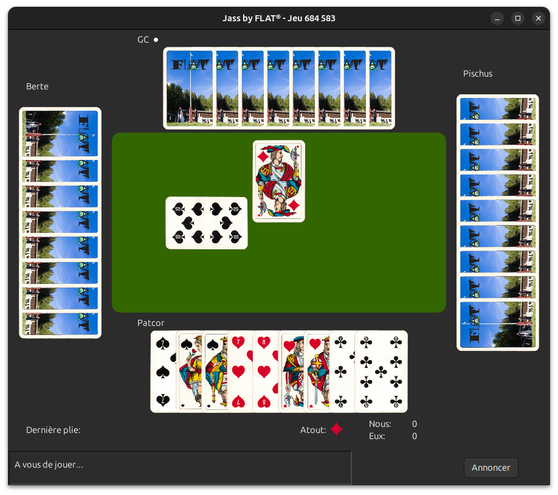

# jass
 

Distributed [Jass](https://en.wikipedia.org/wiki/Jass) game for the members of the FLAT(r)

## How to compile?
Make sure `JAVA_HOME` is defined. Then:

`mvn package`

> [!NOTE]
> If you experience any issue with the unit tests, you can skip them with `mvn package -DskipTests` .

## How to run?
- Compile the code as described above. You'll obtain a `.jar` file in `./target/`.
- Launch the client with `java -jar target/jass-2.1.3-SNAPSHOT.jar`
- Launch the server with `java -cp target/jass-2.1.3-SNAPSHOT.jar com.leflat.jass.server.JassServer`

If you make the jar file executable, you can double-click on the file to launch the client.

## Computer player
The latest version has now a computer player, which can help if you cannot find four participants. The strategy is clearly not state-of-the-art, but it is loosely based on Monte-Carlo sampling and does not play too badly.

You can connect a computer player with
```bash
java -cp target/jass-2.1.3.jar com.leflat.jass.client.ArtificialClient <server_host> <game_id> [<name>]
```
Note that the computer player name is optional.

## How to run on Windows
The game uses Java 11. Unfortunately, Oracle abandoned the JRE
starting from version 11. You will need to install the
[full JDK](https://www.oracle.com/java/technologies/javase-jdk14-downloads.html#license-lightbox).


### Modern UI
