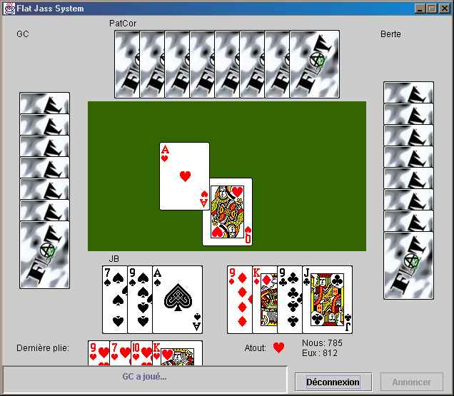

# jass
 

Distributed [Jass](https://en.wikipedia.org/wiki/Jass) game for the members of the FLAT(r)

## How to compile?
`mvn package`

## How to run?
- Compile the code as described above. You'll obtain a `.jar` file in `./target/`.
- Launch the client with `java -jar target/jass-2.0-SNAPSHOT.jar`
- Launch the server with `java -cp target/jass-2.0-SNAPSHOT.jar com.leflat.jass.server.JassServer`

## How to run on Windows
The game uses Java 11. Unfortunately, Oracle abandoned the JRE
starting from version 11. You will need to install the
[full JDK](https://www.oracle.com/java/technologies/javase-jdk14-downloads.html#license-lightbox).

